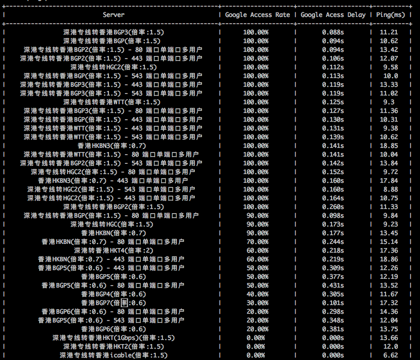

# SSR-speedtest
SSR google curl speed test.


## Requirements

- SSR client [Install](https://github.com/zhanzy178/ssr-speedtest/blob/master/ssr_client/install.sh).
- [proxychains4](https://github.com/rofl0r/proxychains-ng) install.
- Python3 environment with package in [environment.yml](https://github.com/zhanzy178/ssr-speedtest/blob/master/environment.yml): `conda env create -f environment.yml`
- System: Ubuntu16.04
- Sudo system auth


## Usage

Change correspond python complier in `ssr-speedtest.sh`，and write your ssr subscribe url in `sub_urls.txt` in below format:

```
https://www.xxxxx
https://www.yyyyy
https://www.zzzzz
```

Run scripts.

```
bash ssr-speedtest.sh
```


## Result

